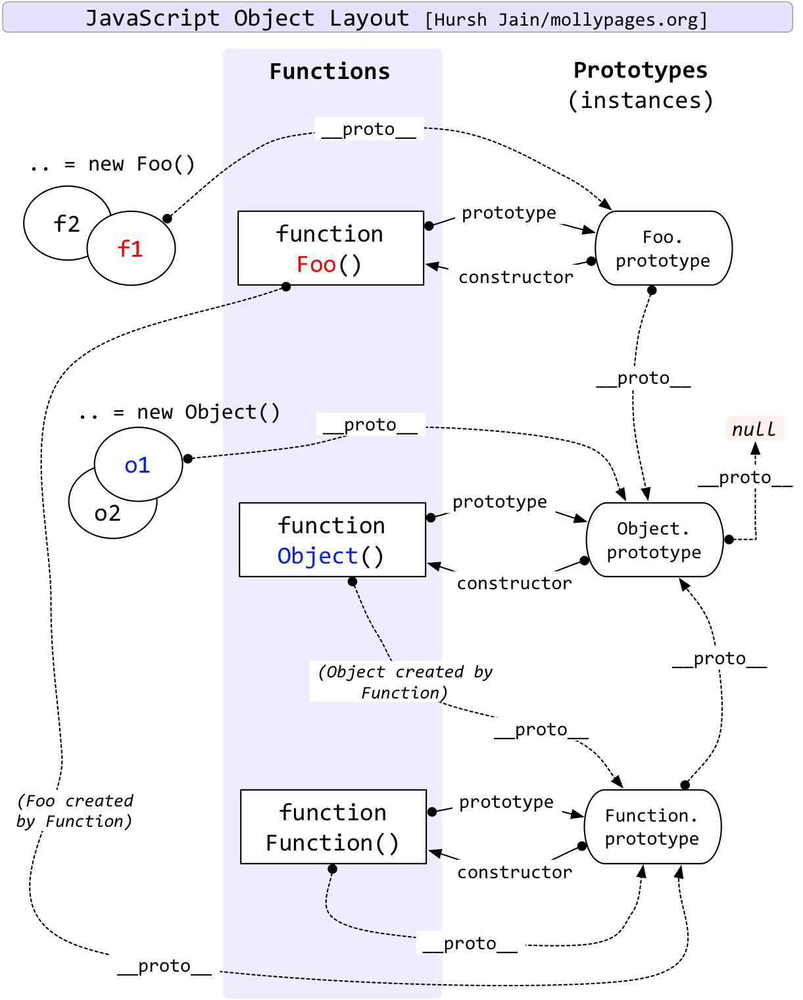

## 2021-07-05
1. JavaScript优雅的实现方法
2. JavaScript原型链

### JavaScript优雅的实现方法
参考资料：[JavaScript 优雅的实现方式包含你可能不知道的知识点](https://github.com/jawil/blog/issues/30)

#### 1.获取时间戳
```
var timestamp = +new Date()
```
#### 2.数组去重
时间复杂度为O(n)
```
var a =  [1, 1, '1', '2', 1]
function unique(arr) {
    var obj = {}
    return arr.filter(function(item, index, array){
        return obj.hasOwnProperty(typeof item + item) ? 
        false : 
        (obj[typeof item + item] = true)
    })
}

console.log(unique(a)) // [1, 2, "1"]
```
#### 3.数字格式化 1234567890 --> 1,234,567,890
3.1 正则表达式
```
function formatNumber(str) {
  return str.replace(/\B(?=(\d{3})+(?!\d))/g, ',')
}

console.log(formatNumber("123456789")) // 1,234,567,89
```
3.2 API版
```
(123456789).toLocaleString('en-US')  // 1,234,567,89
```
#### 4.交换两个整数
```
var a = 3,b = 4;
[b, a] = [a, b]
```
#### 5.将 argruments 对象(类数组)转换成数组
```
var arr = Array.prototype.slice.call(arguments);
var arr = Array.from(arguments);
var args = [...arguments];
```
### JavaScript原型链
参考资料：[JavaScript深入之从原型到原型链](https://github.com/mqyqingfeng/Blog/issues/2)



